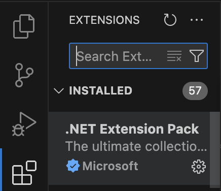
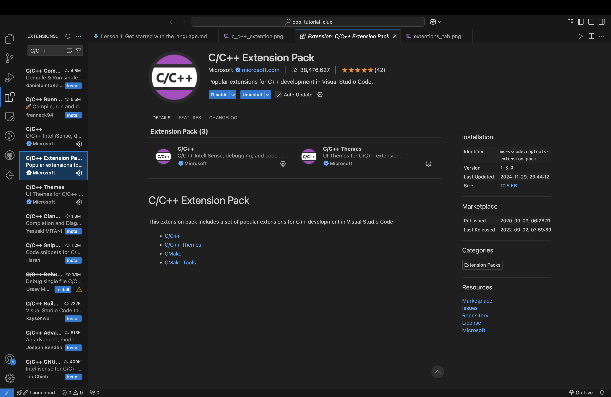

# Lesson 1: Getting started with C++
The C++ language is a compiled language developed in 1966, and have formed the basis of a lot of the internet with its father, the C language. Below, both Mac and Windows setup to start programming in C++.

## Mac Setup
In Mac, the unix system comes default with the clang/clang++ compiler, but here, we will be using the gcc/g++ compiler.

### Install the brew package manager
HomeBrew is a package manager would make your life exponentially easier when downloading mostly programming related tools. Such as gcc, which we are downloading here; llvm and gdb, a great debugger for any compiled language (such as C, C++, Rust, etc.); and other funny cli commands such as `sl`, a command to punish anyone who types `ls` (the list file command), with a rolling ***S***team ***L***ocomotive.


Execute this command in the Terminal, and follow the given prompt.
```zsh
/bin/bash -c "$(curl -fsSL https://raw.githubusercontent.com/Homebrew/install/HEAD/install.sh)"
```
After executing the command, the output should looks something like this:
``` 
❯ /bin/bash -c "$(curl -fsSL https://raw.githubusercontent.com/Homebrew/install/HEAD/install.sh)"
==> Checking for `sudo` access (which may request your password)...
Password:
==> This script will install:
/opt/homebrew/bin/brew
/opt/homebrew/share/doc/homebrew
/opt/homebrew/share/man/man1/brew.1
/opt/homebrew/share/zsh/site-functions/_brew
/opt/homebrew/etc/bash_completion.d/brew
/opt/homebrew

Press RETURN/ENTER to continue or any other key to abort:
==> /usr/bin/sudo /usr/sbin/chown -R kvz:admin /opt/homebrew
==> Downloading and installing Homebrew...
remote: Enumerating objects: 929, done.
remote: Counting objects: 100% (337/337), done.
remote: Compressing objects: 100% (107/107), done.
remote: Total 929 (delta 280), reused 244 (delta 230), pack-reused 592 (from 2)
==> Updating Homebrew...
Updated 2 taps (homebrew/core and homebrew/cask).
==> Installation successful!

==> Homebrew has enabled anonymous aggregate formulae and cask analytics.
Read the analytics documentation (and how to opt-out) here:
  https://docs.brew.sh/Analytics
No analytics data has been sent yet (nor will any be during this install run).

==> Homebrew is run entirely by unpaid volunteers. Please consider donating:
  https://github.com/Homebrew/brew#donations

==> Next steps:
- Run brew help to get started
- Further documentation:
    https://docs.brew.sh
```

### Install the GNU GCC compiler
The GNU GCC compiler is an alternate to the native clang compiler provided by UNIX system, and it is a great tool for both C and C++.

```zsh
brew install g++
```
This would download the newest version of GCC thats present on HomeBrew.

### Install an IDE
IDE (***I***ntergrated ***D***evelopment ***E***nvironment), put it simply, is an application to develop code. In this lesson, we will be using VSCode, one of the most used IDE due to its simplicity to use and how it allows tons of modding to fit your liking.

To install VSCode, simply go to their [main page](https://code.visualstudio.com/)

***DO NOT DOWNLOAD VISUAL STUDIO!!!*** lol

### IDE Setup
After VSCode finishes downloading, you can checkout the "Get Started" page for some guidance in the IDE. After you are satisfied, go to the "Extensions" tab, after opening it, it should look soemthing like this:



Now, install the "C/C++ Extention Pack" which includes C/C++ debugging, syntax, etc. The page should look like this.



Now we are all set to start programming in C++!!