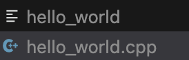

# Lesson 2: Write and run your first program in C++!

After your IDE and installations are setup, now its time to start coding in C++!

## Create a working directory
First, create a new folder to store your files, name it `hello_world`. You can achieve this either in the normal way, through your file explorer, or if you know how to use `cd` and `mkdir`, that is viable as well.

Then, open that folder in VSCode, by pressing `⌘ + O` or `Ctrl + K + O` on windows, and then choosing the folder you just created.

Now, create a new file named `hello_world.cpp`, and we are all set!

## Write your first line of code

Enter into `hello_world.cpp`, and type this as the first line:
```c++
#include <iostream>
```
This line tells the compiler to look for a file named `iostream` in your compiler's `include` path. `iostream` includes some of the core parts a C++ program would use, hence in nearly every single program, you would include `iostream` (unless you are using other older methods from C)

Next, type:
```c++
int main() {

}
```
Unlike some other interpreted languages, a compiled language - such as C++ - requires a `main` function for the compiler to know that it will start reading code from "here".

What you have to know, is that the `main` function is the place where your code will start to execute, and that it must be present for every single file that is not a library file (a file not to be executed, only to be included by other files). All your work shall be done in the `main` function.

## Define a variable

A variable is something, as the name suggests, that could be varied in later stages, something that is mutable. The opposite of a variable in programming, is a constant.

To define a variable, the syntax is as such:
```cpp
data_type variable_name;
// or
data_type variable_name = assign_value;
```

Today, we will be wanting to use a `string`, hence, our variable declaration would look like this:
```cpp
std::string message = "Hello, World!";
```
to break this line down, there are three parts. The data type `std::string`, `message`, `=`, and `"Hello, World!"`.

### `std::string`
`std::string` is a data type found in the `std` namespace, the `<string>` library. The `::` here is telling the compiler that the identifier `string` is a function under the namespace `std`, then the compiler will try to find such data type.

### `message`
`message` is the identifier here is for the programmer to easily reuse the said variable. The name of a variable does not effect anything about it, although, you cannot have two variables holding the same name, otherwise the compiler would complain of the redeclaration.

Example
```cpp
#include <iostream>

int main() {
    int x = 0;
    int x = 10;
    std::cout << x;
    return 0;
}
```

```
❯ g++-14 -o 1 1.cpp; ./1
1.cpp: In function 'int main()':
1.cpp:5:9: error: redeclaration of 'int x'
    5 |     int x = 10;
      |         ^
1.cpp:4:9: note: 'int x' previously declared here
    4 |     int x = 0;
      |  
```

### `=`
The `=` operator in c++ is an assignment operator, it does not perform a comparison, that would be the `==` operator. For example, here, `"Hello, World!"` was assigned to the `message` variable. 

### `"Hello, World!"`
`"Hello, World!"` is of type `string` because of the `""` double quotation marks. This string in C++ would be stored as a pointer to an array of characters. We will not dive too deep to that right now, but it is good to know.

## Printing out the varaible
To print out the variable `message`, we will be using the function `cout` found in the `iostream` library we previously included.

write this into the next line of your function definition:
```cpp
std::cout << message;
```

The use of the intersting `<<` (left shift) operator is intriguing, but we will come back on that later, as this includes operator overloading, a feature of cpp that is not often used.

You simply have to know that this would print out the variable or whatever you put behind the `<<` operator (unless you wrote an error).

Your final program should looks similar to this:

```cpp
#include <iostream>

int main() {
    std::string message = "Hello, World!";
    std::cout << message;
}
```

Now your program is finished!

## Running your program

Running a program is simple, we simply have to use the previously installed g++ to compile and execute the executable!

First, run:
```zsh
g++ -o hello_word hello_world.cpp
```
Now, you should see a new file in the same directory as your C++ file.



Now is time to run the program!

<details>
  <summary>MacOS/Linux</summary>

  ```zsh
  ./hello_world
  ```
  
</details>

<details>
  <summary>Windows</summary>
  
  ```powershell
  hello_world
  ```

</details>

Then afterwards, the output of the program should appear in your terminal, looking something like this

```zsh
~/Desktop/cpp_tutorial_club/test_ground lesson_2*                                                                                                   
❯ g++ -o hello_world hello_world.cpp

~/Desktop/cpp_tutorial_club/test_ground lesson_2*                                                                                 
❯ ./hello_world
Hello, World!%   
```
And now you have successfully wrote and ran your first program in C++!