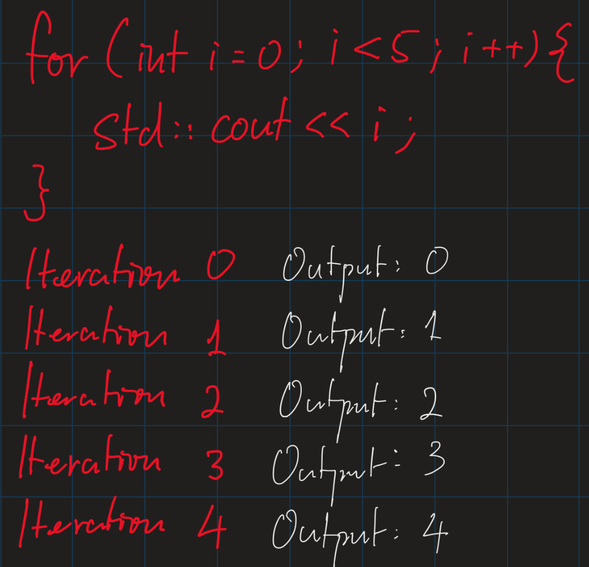
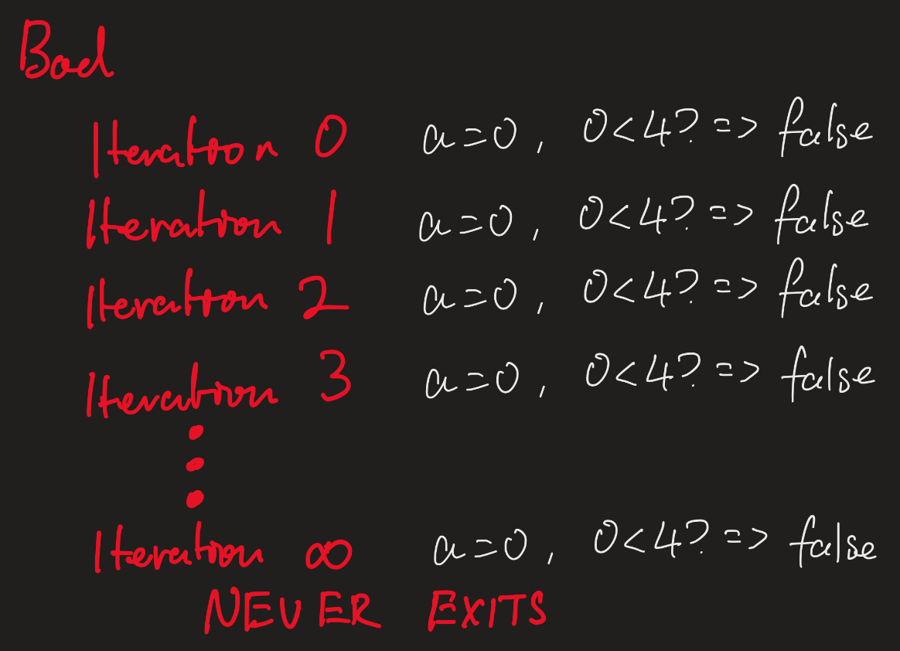
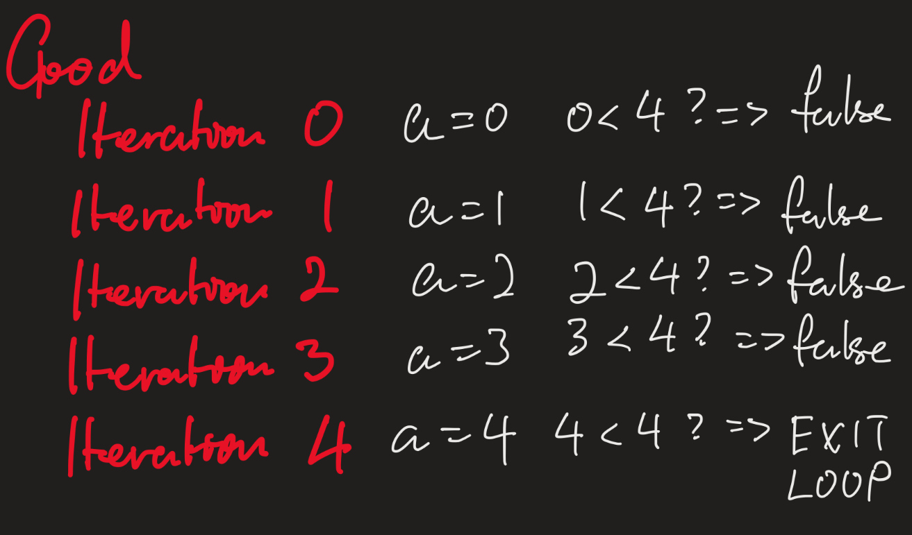

# Lesson 4: Loooooooooops!
Loops are an essential part to any programming language, and C++ is no exception. A loop has a few purposes, including saving you to write ten thousand lines of code for every single condition; iterating through a list; etc.

In this lesson, we will be talking about mainly the `for`, `while`, and an infinite loop. We will also touch on `do-while`, but you would rarely use that.

## "For" loop
In C++, a `for` loop might be the most useful loops. To iterate through a list, to get inputs from `stdin` to lists, and more. To initialise one, use this format:
```cpp
for (int i = starting_value; i < ending_value; i += step_value) {}
```

The three parts in the `for` loop initialisation is `for (starting _value; condition; step value)`



The starting value is easy to grasp, as it is simply where the loop will start. Say you want to start at the 5<sup>th</sup> element of an array, you will make the starting value 4 (since 0 is the first element).

The condition is where you would want the loop to end. Say you want to stop at the 8th element of the array, make `i < 8`, but as you can see, this doesn't include the 8<sup>th</sup> element. Hence, you could use the `<=` operator as well if you like.

The steps are easy to get as well. If you use `i++` (stepping by one) every iteration would be `1 + the last i`. Similarly, if you want the next to be `2 + the last i`, it would be `i += 2`.

## "While" loop
A while loop functions similarly to a `for` loop, but it only takes one single parameter:

```cpp
while (conditions) {}
```
**A condition is something which yield a boolean value, whereby the loop will keep running, until the condition becomes false.**

The conditions could be something like `a < b`, or any other condition you would like to use. But for example for `a < b`, one thing to remember is to increment (or update) `a` every iteration, otherwise the loop would be stuck in a infinite loop, never exiting. 

Bad example: 
```cpp
int a = 0;
while (a < 4) {
    std::cout << a;
    //this loop will not exit, you can compile this yourself to try it out.
}
```


Good example:
```cpp
int a = 0;
while (a < 4) {
    std::cout << a;
    a++; //increment a, otherwise a will always be 0, and the loop will continue forever.
}
```



## Infinite loop
A infinite loop is a loop that will fun forever until it reaches a base condition. To initialise one, there are two methods.

```cpp
//prefered
while (true) {} //or while(1) as we mentioned before, true is simply 1 (#define true 1)
//works the same, but makes confusion in codes
for(;;) {}
```

A infinite loop is useful when you don't know the value for it to run until (which is required in a for and while loop), but you know the base condition for the loop to exit. Hence, the most important thing when writing an infinite loop, is to always, always have a base case for the loop to terminate, otherwise your program will just simply get stuck.

## "do-while" loop
A do while loop is a variant of the while loop, it looks like this:

```cpp
do {
    //processes
} while (conditions)
```

a do-while loop makes sure that the code body gets executed at least once, no matter if the condition is true or not. This type barely gets used in my opinion, hence, you don't have to worry about it too much.