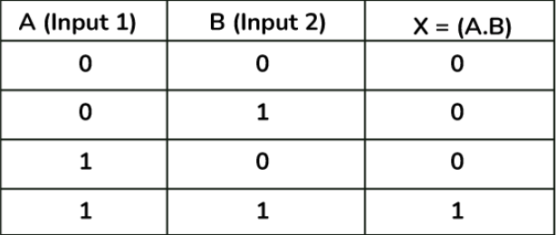
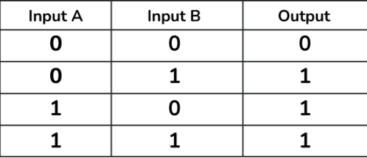
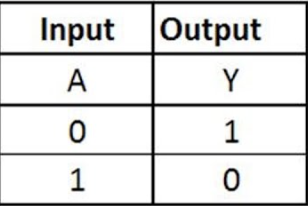
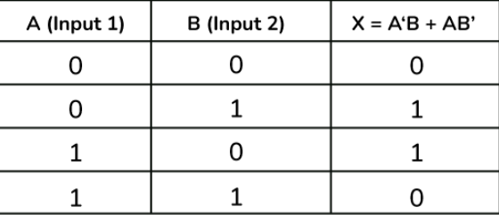

# Arithmetic Operators
- `+` Addition
- `-` Subtraction
- `*` Multiplication
- `/` Division
  - One thing to note about arithemtics in C++ is that most of the primitive data types have automatic casting built into them. For example, if you make `int i = 0.5`, `i` will automatically become `0`. This becomes useful when you don't want the decimal places in a division, say `4/3`, if the data type is an `int`, the value will simply be `1` (but it will always floor it, even `1.9999` will become `1`. If you want to make it always the opposite, you can use the `ceil()` function found in <cmath> library)

- `%` Modulus
  - Returns the remainder of a division 
  - modulus(x): Z+ -> Z+ (always returns a positive integer, including zero)
- `++` increment
  - if `int i = 0`, after `i++`, `i` = 1.
- `--` decrement
  - if `int i = 1`, after `i--`, `i` = 0.

# Bitwise Operators
- `&` And
  - `01101001` & `11110001` = `01100001`
  - 105 & 241 = 97
  - Joins the bits which are the same in both numbers
   

- `|` Or
  - `01101001` | `11110001` = `11111001`
  - 105 | 241 = 249
  - Joins the bits that simply exists in both numbers
    

- `~` Not
  - ~`01101001` = `10010110` (technically `-10010110`)
  - ~105 = -106, negative due to the sign been reversed.
  - flips all bits in a number
  
    

- `^` Exlusive Or
  - `11110000` ^ `10101010` = `01011010`
  - 240 ^ 170 = 90
  - Not like math, `^` is not to the power of somthing, that would be a seperate function found in the <cmath> library named `pow()`
  - It is like `or`, but when both bits are `1`, it returns `0`.
  
    

- `<<` Left Shift
  - `11001111` << `4` = `11110000` (in a 8 bit type)
  - 207 << 4 = 240
  - If it is a 32-bit environment, it would become
    - `leading zeros...11001111` << `4` = `leading zeros...110011110000`

- `>>` Right Shift
  - The opposite of left shift

# Conditional Operators
This is used in `if`, `else`, `for`, `while`, etc. To evaluate whether the loop (or the condition) will be executed or not (returns a boolean).

- `==` Is Equal To
  - `1 == 2` => `false`
  - `2 == 2` => `true`
  
- `!=` Is Not Equal To
  - `1 != 2` => `true`
  - `2 != 2` => `false`

- `>`, `<`, `<=`, `>=`
  - All are the same, they are greater than, smaller than, smaller or equal to, greater or equal to, respectively.

# Logical Operator
This can also be used for conditional values, as it returns a boolean as well.

- `!` Logical Not
  - Makes a true condition false
    - `!true` => `false`
    - `!false` => `true`

- `||` Logical Or
  - If either of all conditions are true, return true
    - `true || false` => `true`

- `&&` Logical And
  - Only returns true if both conditions are true
    - `true && true` => `true`
    - `true && false` => `false`

